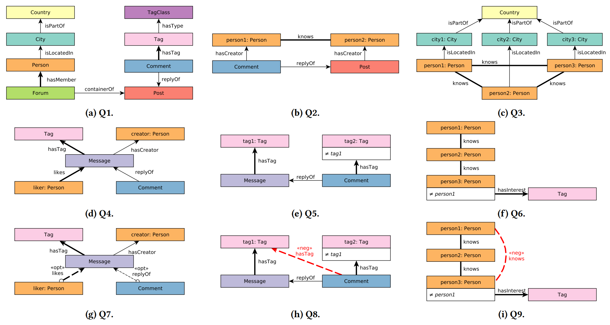

# Labelled Subgraph Query Benchmark (LSQB)

[](https://circleci.com/gh/ldbc/lsqb)

:page_facing_up: [LSQB: A Large-Scale Subgraph Query Benchmark](https://dl.acm.org/doi/pdf/10.1145/3461837.3464516), GRADES-NDA'21 paper ([presentation](https://docs.google.com/presentation/d/13B5XwwSlgi-r3a9tKNxo8HmdIRzegO6FMB-M6I1RW0I))

## Overview

A benchmark for subgraph matching but with type information (vertex and edge types). The primary goal of this benchmark is to test the query optimizer (join ordering, choosing between binary and n-ary joins) and the execution engine (join performance, support for worst-case optimal joins) of graph databases. Features found in more mature database systems and query languages such as date/string operations, query composition, complex aggregates/filters are out of scope for this benchmark.

The benchmark consists of the following 9 queries:



Inspirations and references:

* [VLDB'19 keynote by Tamer Özsu](https://vldb2019.github.io/files/VLDB19-keynote-1-slides.pdf)
* [CACM'21 technical perspective paper on graphs](https://dl.acm.org/doi/pdf/10.1145/3434642)

## Getting started

### Install dependencies

1. Install Docker on your machine.

1. (Optional) Change the location of Docker's data directory ([instructions](https://github.com/ftsrg/cheat-sheets/wiki/Docker#move-docker-data-folder-to-a-different-location)).

1. Install the required dependencies:

   ```bash
   scripts/install-dependencies.sh
   ```

1. (Optional) Install "convenience packages" (e.g. vim, ag, etc.).

   ```bash
   scripts/install-convenience-packages.sh
   ```

1. (Optional) Add the Umbra binaries as described in the `umb/README.md` file.

1. (Optional) "Warm up" the system using `scripts/benchmark.sh`, e.g. run all systems through the smallest `example` data set. This should fill Docker caches.

1. (Optional) Copy the data sets to the server. To **decompress and delete** them, run:

   ```bash
   for f in social-network-sf*.tar.zst; do echo ${f}; tar -I zstd -xvf ${f}; rm ${f}; done
   ```

1. Revise the benchmark settings, e.g. the number of threads for DuckDB.

### Creating the input data

Data sets should be provided in two formats:

* `data/social-network-sf${SF}-projected-fk`: projected foreign keys, the preferred format for most graph database management systems.
* `data/social-network-sf${SF}-merged-fk`: merged foreign keys, the preferred format for most relational database management systems.

An example data set is provided with the substitution `SF=example`:

* `data/social-network-sfexample-projected-fk`
* `data/social-network-sfexample-merged-fk`

Pre-generated data sets are available in the [SURF/CWI data repository](https://repository.surfsara.nl/datasets/cwi/lsqb).

To download the data sets, set the `MAX_SF` environment variable to the size of the maximum scale factor you want to use (at least `1`) and run the download script.

For example:

```bash
export MAX_SF=3
scripts/download-projected-fk-data-sets.sh
scripts/download-merged-fk-data-sets.sh
```

For more information, see the [download instructions and links](https://github.com/ldbc/data-sets-surf-repository/#labelled-subgraph-query-benchmark-lsqb).

#### Generating the data sets from scratch

You can generate your own data sets. Note that these may differ in size for different versions of the data generator – for publications, it's recommended to use the pre-generated data sets linked above.

1. Run the [LDBC Sparj Datagen](https://github.com/ldbc/ldbc_snb_datagen/) using CSV outputs and raw mode (see its README for instructions).

1. Use the scripts in the [converter](https://github.com/ldbc/ldbc_snb_data_converter) repository:

   ```bash
   cd out/csv/raw/composite_merge_foreign/
   export DATAGEN_DATA_DIR=`pwd`
   ```

1. Go to the [data converter repository](https://github.com/ldbc/ldbc_snb_data_converter):

   ```bash
   ./spark-concat.sh ${DATAGEN_DATA_DIR}
   ./load.sh ${DATAGEN_DATA_DIR} --no-header
   ./transform.sh
   cat export/snb-export-only-ids-projected-fk.sql | ./duckdb ldbc.duckdb
   cat export/snb-export-only-ids-merged-fk.sql    | ./duckdb ldbc.duckdb
   ```

1. Copy the generated files:

   ```bash
   export SF=1
   cp -r data/csv-only-ids-projected-fk/ ~/git/snb/lsqb/data/social-network-sf${SF}-projected-fk
   cp -r data/csv-only-ids-merged-fk/    ~/git/snb/lsqb/data/social-network-sf${SF}-merged-fk
   ```

### Running the benchmark

The following implementations are provided. The :whale: symbol denotes that the implementation uses Docker.

Stable implementations:

* `umb`: [Umbra](https://umbra-db.com/) [SQL] :whale:
* `hyp`: [HyPer](https://hyper-db.de/) [SQL] :whale:
* `ddb`: [DuckDB](https://www.duckdb.org/) [SQL] (embedded)
* `pos`: [PostgreSQL](https://www.postgresql.org/) [SQL] :whale:
* `mys`: [MySQL](https://www.mysql.com/) [SQL] :whale:
* `neo`: [Neo4j Community Edition](https://neo4j.com/) [Cypher] :whale:
* `red`: [RedisGraph](https://oss.redislabs.com/redisgraph/) [Cypher] :whale:
* `mem`: [Memgraph](https://memgraph.com/) [Cypher] :whale:
* `vos`: [Virtuoso Open-Source Edition](http://vos.openlinksw.com/owiki/wiki/VOS) [SPARQL] :whale:
* `xgt`: [Trovares xGT](https://www.trovares.com/) [Cypher] :whale:
* `rdm`: [RapidMatch](https://github.com/RapidsAtHKUST/RapidMatch) [`.graph`] (separate process)

WIP implementations:

* `kuz`: [Kùzu](https://kuzudb.com/) [Cypher] (embedded)

:warning: Both Neo4j and Memgraph use the Bolt protocol for communicating with the client.
To avoid clashing on port `7687`, the Memgraph instance uses port `27687` for its Bolt communication.
Note that the two systems use different Bolt versions so different client libraries are necessary.

#### Running the benchmark

The benchmark run consists of two key steps: loading the data and running the queries on the database.

Some systems need to be online before loading, while others need to be offline. To handle these differences in a unified way, we use three scripts for loading:

* `pre-load.sh`: steps before loading the data (e.g. starting the DB for systems with online loaders)
* `load.sh`: loads the data
* `post-load.sh`: steps after loading the data (e.g. starting the DB for systems with offline loaders)

The `init-and-load.sh` script calls these three scripts (`pre-load.sh`, `load.sh`, and `post-load.sh`).
Therefore, to run the benchmark and clean up after execution, use the following three scripts:

* `init-and-load.sh`: initialize the database and load the data
* `run.sh`: runs the benchmark 
* `stop.sh`: stops the database

Example usage that loads scale factor 0.3 to Neo4j:

```bash
cd neo
export SF=0.3
./init-and-load.sh && ./run.sh && ./stop.sh
```

Example usage that runs multiple scale factors on DuckDB. Note that the `SF` environment variable needs to be exported.

```bash
cd ddb
export SF
for SF in 0.1 0.3 1; do
   ./init-and-load.sh && ./run.sh && ./stop.sh
done
```

## Cross-validation

Used the `cross-validate.sh` script. For example:

```bash
scripts/cross-validate.sh --system DuckDB --variant "10 threads" --scale_factor 1
scripts/cross-validate.sh --system Neo4j --scale_factor 0.1
scripts/cross-validate.sh --system PostgreSQL --scale_factor example
```

## Philosophy

* This benchmark has been inspired by the [LDBC SNB](https://arxiv.org/pdf/2001.02299.pdf) and the [JOB](https://db.in.tum.de/~leis/papers/lookingglass.pdf) benchmarks.
* First and foremost, this benchmark is designed to be *simple*. In the spirit of this, we do not provide auditing guidelines – it's the user's responsibility to ensure that the benchmark setup is meaningful. We do not provide a common Java/Python driver component as the functionality required by the driver is very simple and can be implemented by users ideally in less than an hour.
